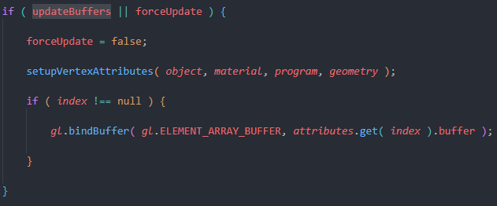
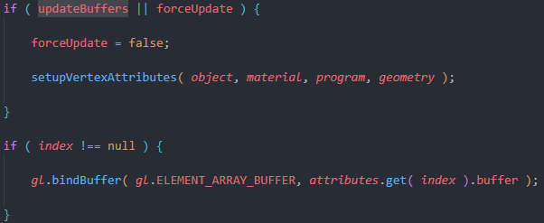
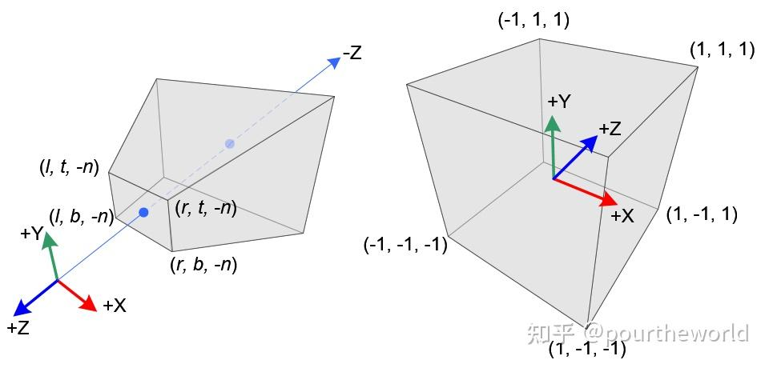
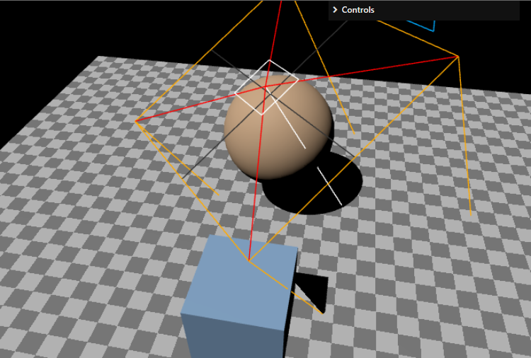

# THREE 和 Cesium 深度融合技术分享

点击进行预览：[THREE 和 Cesium 深度融合示例](https://htmlpreview.github.io/?https://github.com/zan1105/ThreeJS_CesiumJS/blob/main/index.html)

## 1. 为什么要融合 THREE 和 Cesium

### 1.1 为什么要融合 THREE 和 Cesium

THREE 和 Cesium 是两个非常优秀的开源项目，分别是 3D 场景渲染和地理信息可视化领域的翘楚。THREE 以其强大的 3D 场景渲染能力和丰富的 3D 场景渲染特效而著称，而 Cesium 以其强大的地理信息可视化能力和丰富的地理信息可视化特效而著称。融合 THREE 和 Cesium 可以将两者的优势结合起来，形成一个更加强大的整体，为用户提供更加丰富的 3D 场景渲染和地理信息可视化功能。

### 1.2 融合 THREE 和 Cesium 的优势

融合 THREE 和 Cesium 的优势主要有以下几点：

1. **丰富的 3D 场景渲染和地理信息可视化特效**：THREE 和 Cesium 分别擅长于 3D 场景渲染和地理信息可视化领域，融合后可以将两者的特效结合起来，为用户提供更加丰富的 3D 场景渲染和地理信息可视化功能。

2. **强大的 3D 场景渲染和地理信息可视化能力**：THREE 和 Cesium 分别具有强大的 3D 场景渲染和地理信息可视化能力，融合后可以将两者的能力结合起来，为用户提供更加强大的整体功能。

3. **更加灵活的开发方式**：融合 THREE 和 Cesium 可以让开发者更加灵活地选择使用哪种功能，从而更好地满足用户的需求。

## 2. 现有的 THREE 和 Cesium 融合方案

目前已经有一些关于 THREE 和 Cesium 融合的方案，主要有以下几种：

1. **将 THREE 场景作为模型加载到 Cesium 场景中**：这种方案主要是将 THREE 场景作为模型加载到 Cesium 场景中，从而实现 THREE 和 Cesium 的融合。这种方案的优点是比较简单，但是由于 THREE 和 Cesium 的坐标系不同，需要进行坐标系转换，而且**性能方面也存在一定的问题**。

2. **在两个画布上分别渲染 THREE 和 Cesium 后对齐**：这种方案主要是在两个画布上分别渲染 THREE 和 Cesium 场景，从而实现 THREE 和 Cesium 的融合。这种方案的优点是比较灵活，但是由于需要在两个画布上分别渲染，**深度无法统一**。

3. **在同一画布中将 Cesium 渲染结果作为 THREE 纹理**：这种方案主要是将 Cesium 渲染结果作为 THREE 纹理，从而实现 THREE 和 Cesium 的融合。这种方案的优点是比较简单，但是由于 Cesium 渲染结果作为 THREE 纹理，**我们采用的就是这种方案**。不仅可是实现画面对齐，而且可以实现深度、阴影等的统一。

## 3. THREE 和 Cesium 深度融合的技术实现

### 3.1 THREE 和 Cesium 深度融合的主要步骤

1. **在同一画布和 WebGL 上下文中渲染 THREE 和 Cesium 场景**：主要目的是在 THREE 中直接能拿到 Cesium 的在 GPU 的渲染结果，这样 THREE 中融合 Cesium 时的所有操作都在 GPU 中进行，对性能的影响很小。

2. **获取 Cesium 的渲染结果**：主要目的是在 THREE 中获取 Cesium 的渲染画面和深度，这样在 THREE 中就可以根据 Cesium 的渲染结果进行后续的操作。

3. **在 THREE 中融合 Cesium 的渲染结果**：主要目的是在 THREE 中根据 Cesium 的渲染结果如何将 Cesium 的渲染结果融合到 THREE 的渲染结果中，从而实现 THREE 和 Cesium 的深度融合

### 3.2 THREE 和 Cesium 深度融合的技术难点与解决方法

#### 3.2.1 WebGL 状态错误

THREE 和 Cesium 都会对 WebGL 状态进行修改，直接在同一 WebGL 上下文中渲染会导致状态错误。

<blockquote>renderer.resetState();//每一帧在 Cesium 渲染后 THREE 渲染前需要重置 THREE 的渲染状态</blockquote>

<blockquote>Cesium 渲染时会改变 WebGl 的顶点数组缓冲区的绑定状态，因此 Three 渲染前需要重新绑定。更改 Three 源码 `WebGLBindingStates/setup/if (updateBuffers || forceUpdate)`中绑定缓冲区的条件：让每一帧都重新绑定。</blockquote>

	
更改前：

更改后：

#### 3.2.2 获取 Cesium 的渲染画面和深度

Cesium 没有提供直接获取渲染结果的接口，需要通过 Cesium 的后期处理效果来获取渲染结果。

Cesium 后期处理过程会根据设置的顺序全部执行完成后，直接将渲染结果输出，外部无法中断（意味着无法通过渲染一个后期处理直接拿到想要的结果，这点和 THREE 不一样）。

查看 Cesium 后期处理的源码，找到后期处理渲染流程中后期处理如何获取上一个后期处理的结果。

#### 3.2.3 Cesium 的纹理如何转为 THREE 的纹理

虽然 Cesium 和 THREE 都是基于 WebGL 的，但都对 WebGL 纹理做了二次封装，在 THREE 中会对 shader 做一次编译，直接使用 Cesium 的纹理会导致 shader 编译错误。

<blockquote>将两个不同类型的事物联系起来的关键点是他们的共同点</blockquote>

Cesium 和 THREE 都是基于 WebGL 的，这给将 Cesium 的纹理转为 THREE 的纹理提供了一种思路：**首先获取到 Cesium 纹理中的 WebGL 纹理对象，然后将 WebGL 纹理对象转为 THREE 纹理对象。**

**Cesium 纹理转 WebGL 纹理**：查看 Cesium 的纹理对象，发现其中 `_texture` 属性就是 WebGL 纹理对象。

THREE 中大多纹理都是从 cpu 内存中加载而并不是直接从 GPU 获取的，WebGL 纹理不能转为这类纹理。

参考 THREE 后处理，都是通过 `WebGLRenderTarget` 来获取渲染结果为 THREE 纹理的，而渲染结果实际上都是在 GPU 中生成的 WebGL 纹理。猜测 `WebGLRenderTarget` 有将 Webgl 纹理转为 THREE 纹理的能力，查看官方文档发现 `WebGLRenderTarget` 并没有直接提供相关的接口。但基于实现渲染和高性能要求，肯定不会将渲染结果拿到 CPU 中。查看源码，果然发现 `WebGLRenderTarget` 还带有一层只在 THREE 渲染管线中使用但未暴漏给用户的隐藏属性，其中 `__webglTexture` 属性就对应着 WebGL 纹理对象。这一层属性的获取方法是 `renderer.properties.get(texture).__webglTexture`。

看起来好像任意的纹理都可以关联到 WebGL 纹理对象，但是实际上只有 `WebGLRenderTarget` 的纹理才能在没有图像源数据下生成 WebGL 纹理对象。其他纹理都是通过将图像源数据上传到 GPU 中才生成的 WebGL 纹理对象。其他纹理调用上述方法马上报错给你看。

到这一步就能将 Cesium 的纹理转为 THREE 的纹理了。也就可以考虑如何将 Cesium 的渲染结果融合到 THREE 的渲染结果中了。

#### 3.2.4 在 THREE 中融合 Cesium 的渲染画面

想象一下 THREE 场景融合 Cesium 画面后的效果，Cesium 的地图应该在 THREE 场景的后面，并且 THREE 场景中的空白部分应该显示 Cesium 地图。整个画面不能有空白，换句话说，**Cesium 地图应该填充整个画布**。

第二点是不管 THREE 的相机怎么移动，Cesium 画面都应该在视野中，也就是说展示 Cesium 画面的载体应该是**始终在相机视野中**。

综合以上两点，可以将创建一个平面，将 Cesium 的渲染结果作为平面的纹理，现在的问题是如何让平面始终在相机前面，并且填充整个画布。

#### 3.2.5 深度同步

THREE 中的物体位于地下时能够被 Cesium 地形遮挡，Cesium 地图和 THREE 场景的深度应该是统一的，也就是说需要实现 **深度同步**。

按理说，只要将 Cesium 的深度信息传递给 THREE，然后在 THREE 中根据 Cesium 的深度信息来调整 Cesium 的渲染结果就可以实现深度同步了。但实际上没有这么简单。

首先，在 Cesium 的后期处理中拿到的深度由于精度问题是分装在 RGBA 中的，需要将 RGBA 中的深度合为一个深度值。而且 Cesium 中的深度默认是对数深度，而 THREE 中的默认深度是线性深度，需要将 Cesium 的对数深度转为线性深度。

其次，由于 Cesium 是从近到远分段渲染的，深度值也是分段的。需要将分段的深度值转为全局统一的线性深度。查看源码后发现 Cesium 自身提供解析成线性深度的方法。但解析完的深度还是分段的，这时候就需要了解一下深度是是怎样计算的了。

虽然同一位置在不同分段时深度值不同，但不管怎样分段，这都是同一个位置，它在相机空间中的坐标都一样。因此，虽然深度不同，但 Z 轴方向距离是统一的（不仅在不同分段统一，而且和 THREE 的相机空间 Z 距离也统一）。只要根据深度计算出它在相机空间中的 Z 轴方向距离，这样就可以根据这个 Z 轴方向距离和 THREE 的相机近远裁面就可以计算出当前位置在 THREE 中的线性深度了。为了保持高精度，将解析后的深度再分装（ Ceiusm 的分装方法有将 1 分装成 0 的 bug ）在 RBGA 四个通道中。在 THREE 的 shader 中只需要将这四个通道合并成一个深度值就可以了。

#### 3.2.6 相机同步

截止到目前，Cesium 的渲染结果已经融合到 THREE 的渲染结果中了，但是 Cesium 的相机和 THREE 的**相机并没有同步**，简单来讲就是 Cesium 的相机移动时，THREE 的相机并没有跟着移动。或者 THREE 的相机移动时，Cesium 的相机并没有跟着移动。只是简单的将画面融合到一起。

在同步相机之前首先要确定坐标系，Cesium 和 THREE 的坐标系是不同的，Cesium 中存在多种坐标系： ECEF 地心地固直角坐标系、LLA 经纬高坐标系、ENU 东北天局部坐标系等，而 THREE 中的坐标系是右手坐标系。

由于 THREE 场景可以脱离 Cesium 独立使用，将 THREE 的坐标系转换到 Cesium 的坐标系是不现实的。因此，只能将 Cesium 的坐标系转换到 THREE 的坐标系。而 Cesium 中的 ENU 东北天局部坐标系和 THREE 的右手坐标系比较接近，只需要将 Cesium 的 ENU 坐标系和 THREE 的坐标系的坐标轴做一次映射就可以了。

<blockquote>Cesium 的 XYZ 对应 THREE 的 ZXY</blockquote>

具体来说，在 Cesium 中设置一个 ENU 东北天坐标系的原点后可以获得一个从 ENU 到 ECEF 和从 ECEF 到 ENU 的转换矩阵。Cesium 的相机使用的是 ECEF 坐标系，将 Cesium 的相机位置转换到 ENU 坐标系后，再将 ENU 坐标系转换到 THREE 的坐标系，就可以得到 THREE 的相机位置了。从 THREE 的位置向 Cesium 的坐标转换和上述过程相反。

此外，将 THREE 的场景放置在地球上时可能需要做旋转和缩放操作才能匹配真实地球，这两个步骤可以加入相机的坐标转换过程中，因为场景和旋转其实等价于相机位置（绕场景移动）和朝向的改变，缩放等价于相机位置（到场景原点的距离）的改变。

#### 3.2.7 阴影同步

由于 Cesium 的场景和 THREE 的场景是分开渲染的，因此 THREE 场景中的物体不会在地球地面投射阴影。查看 THREE 源码，发现 THREE 的阴影是通过光源的阴影贴图实现的，简单来说就是在要投射阴影的光源位置渲染一个深度贴图，然后在场景中的物体上根据物体的深度对比深度贴图计算阴影。

Cesium 的地球地面在 THREE 中可以当作一个平面，而光照阴影贴图其实在 THREE 渲染管线中已经存在，只需要在绘制地面时模拟 THREE 处理阴影的过程就可以了。

具体来说，需要在前文提到的平面的着色器中引入 THREE 计算阴影使用到的 Shader 片段，查看 Shader 源码发现，在处理阴影的过程中只用到当前顶点的世界空间坐标，虽然平面我们做了特殊处理，但我们可以基于深度值将顶点从屏幕空间转换到世界空间（先转化到裁剪空间，再转化到视图空间，最后转化到世界空间），这样就可以得到顶点的世界空间坐标了。为了使计算阴影的顶点插值更精确，绘制 Cesium 画面的平面可以将横纵分段数设置大一些（横 20 竖 80）；

#### 3.2.8 天空过渡

Cesium 的渲染能力较差，使用 THREE 的天空盒可以提高渲染效果，但当视角在地球外时又要使用 Cesium 的天空盒（星空北京）。这时就需要在一定高度时对 Cesium 的天空盒和 THREE 的天空盒之间做一个过渡。

由于绘制 Cesium 的平面始终在相机前方，而天空是绘制在最外层的，怎样能看到 THREE 的天空呢？

此时首先想到的是能不能根据一定条件透过这个平面看到 THREE 的天空。要实现这个逻辑，首先要确定这个平面能否启用透明度，然后要确定这个平面的透明度如何控制。能实现这两个逻辑就说明可以透过平面看到 THREE 的天空了。

THREE 中的所有材质都可以启用透明度，现在的问题就是如何控制这个平面的透明度。我们要的效果是地面的地方显示地面，天空的地方显示天空。所以核心问题是 Cesium 中如何区分地面和天空，没错，就是深度值，地面的深度值都小于 1，而天空的深度值等于 1（深度最大为 1）。所以只要将深度值 为 1 的地方设置透明度。具体设置多少就看相机在什么高度开始出现 Cesium 的天空，在什么高度 THREE 的天空完全消失了。
